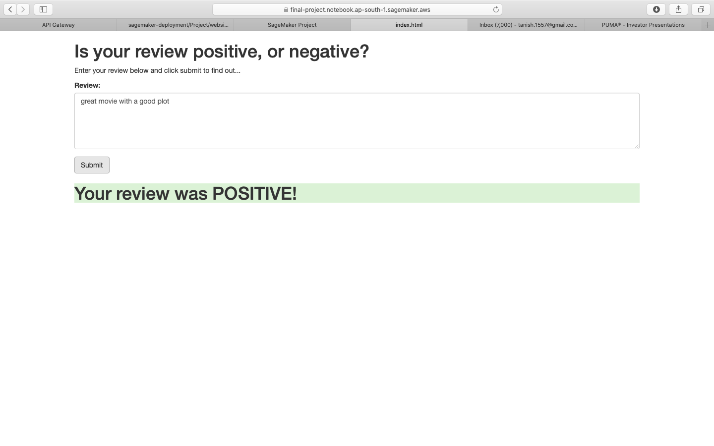

# Sagemaker_Project
Creating a Sentiment Analysis Web App Using PyTorch and SageMaker

## General Outline

1. Download or otherwise retrieve the data.
2. Process / Prepare the data.
3. Upload the processed data to S3.
4. Train a chosen model.
5. Test the trained model (typically using a batch transform job).
6. Deploy the trained model.
7. Use the deployed model.

## Data
[IMDb dataset](http://ai.stanford.edu/~amaas/data/sentiment/)

## Results

## Tech Stack
1. [PyTorch](https://pytorch.org/)
2. [SageMaker](https://aws.amazon.com/sagemaker/)
